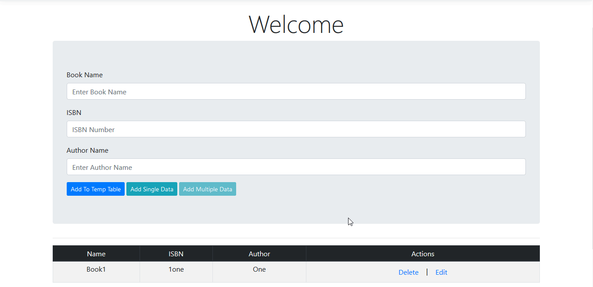
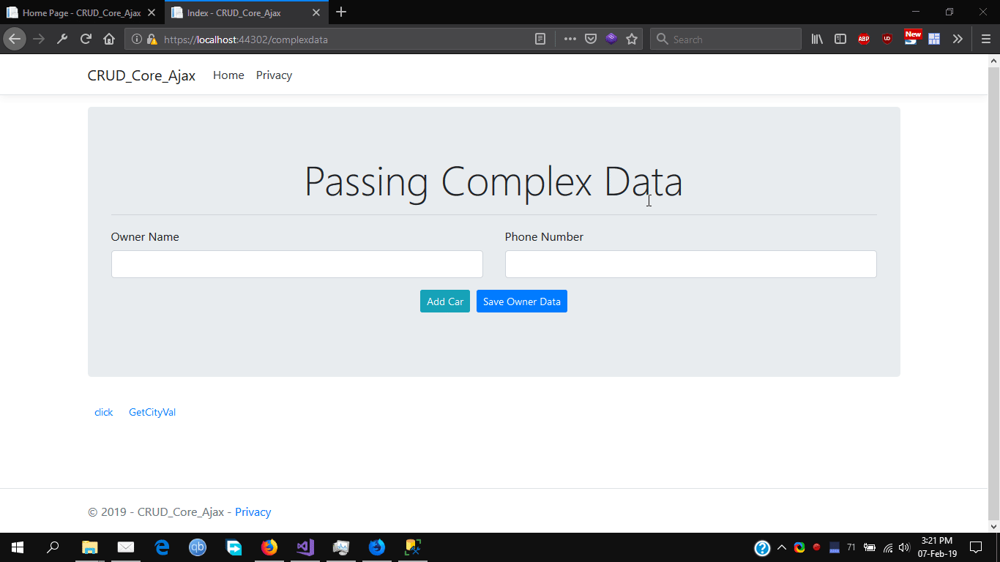
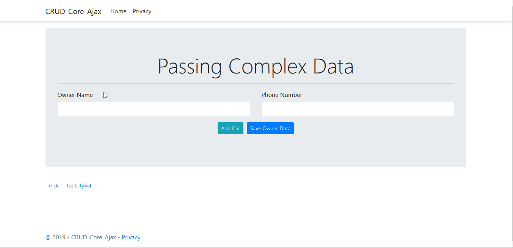

# Practicing-ASP.NET-Core-2.2-AJAX-MVC 👏

## Working with ASP.NET Core 2.2. Performing CRUD operations in Core-MVC with AJAX.

### Passed Complex Data and List of Complexed Json Data to Action Using AJAX.

📑💫💻

(A link to pass Complex data list to action added separately on View "click")

## Proper Comments for Understanding & Readable Easy Code! "Written Separately!" 🤟🤟🤟

---

## 1️⃣ Demo in Motion <u>**(Basic CRUD with AJAX)**</u>: 😉

### _CRUD Ajax in .Net Core Mvc. First added data to Temp table then on click save all temp data to DataBase._

---

---

## 2️⃣ Demo in Motion <u>**(Saving Complex Data with AJAX)**</u>: 😉

### _Saving Complex Data (Parent > Child Relation) to Database over AJAX in .Net Core MVC._

(Open "local.../ComplexData" url to Open ComplexData Action View)

---

## 3️⃣ Demo in Motion <u>**(Passing List Of Complex Data with AJAX)**</u>: 😉

### _Passing List Of Complex Data with Nested/Multiple Foreign Key Relation to Database over AJAX to Action Successfully in .Net Core MVC._

(A link with name "CLICK" was at bottom of page which on click send request and pass data to Action)

---

## 📄 License 🔐

Practicing-ASP.NET-Core-2.2-AJAX-MVC (ASP.NET-CORE-CRUD-AJAX)
Copyright (C) 2019 - Arslan Ameer

This program is free software: you can redistribute it and/or modify
it under the terms of the GNU General Public License as published by
the Free Software Foundation, either version 3 of the License, or
(at your option) any later version.

This program is distributed in the hope that it will be useful,
but WITHOUT ANY WARRANTY; without even the implied warranty of
MERCHANTABILITY or FITNESS FOR A PARTICULAR PURPOSE. See the
GNU General Public License for more details.

You should have received a copy of the GNU General Public License
along with this program. If not, see <http://www.gnu.org/licenses/>
